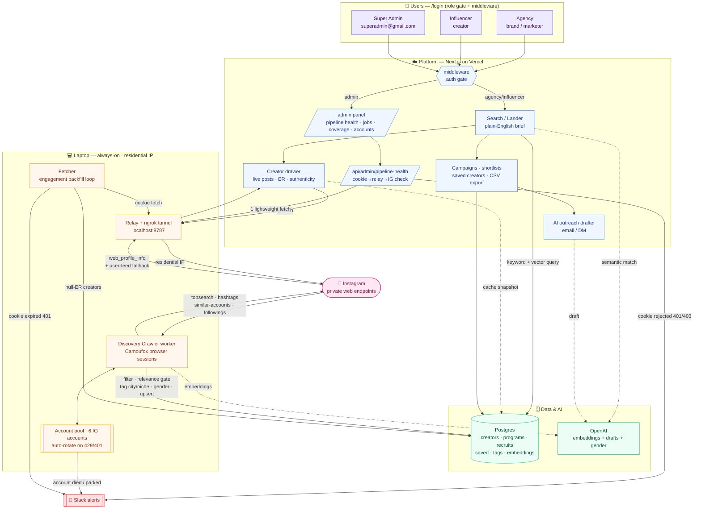
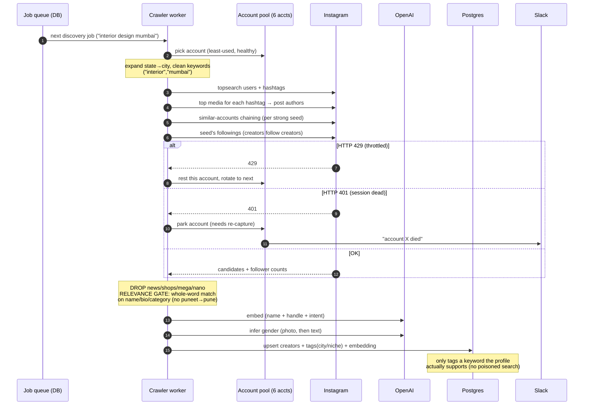
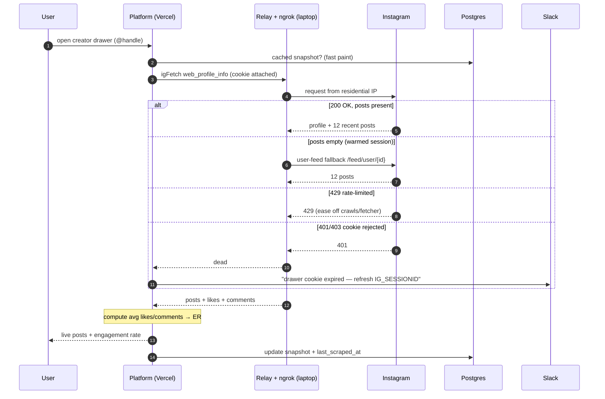

# Influencer Intel — System & Workflow Architecture

A plain-English influencer-marketing platform. Two Instagram data engines feed a
Next.js app: a **Discovery Crawler** (breadth — builds the database) and a
**Live Data path** (depth — real-time posts & engagement on demand).

- **Platform**: Next.js 15 / React 19 on Vercel (datacenter IP)
- **Laptop (always-on, residential IP)**: crawler worker + Fetcher + relay/ngrok
- **Database**: Boltic Postgres
- **AI**: OpenAI (embeddings for semantic search + outreach drafts)
- **Alerts**: Slack incoming webhook

---

## 1. Master architecture



---

## 2. Discovery Crawler — how the database gets filled

Breadth engine. Runs on the laptop, rotates across 6 accounts, never blocks.



---

## 3. Live Data path — the drawer & Fetcher

Depth engine. Production can't reach Instagram directly (datacenter IP), so every
live call is tunnelled through the laptop's relay (residential IP) using one
logged-in cookie.



---

## 4. Health monitoring & alerts

```mermaid
flowchart LR
  classDef edge fill:#fff7ed,stroke:#f59e0b,color:#7c2d12
  classDef alert fill:#fee2e2,stroke:#ef4444,color:#7f1d1d
  classDef plat fill:#eff6ff,stroke:#3b82f6,color:#1e3a8a

  CRON{{scheduled check<br/>(laptop cron / Vercel cron)}}:::edge
  PANEL[admin panel poll<br/>every 30s]:::plat
  H[/pipeline-health<br/>1 authenticated fetch/]:::plat

  CRON --> H
  PANEL --> H
  H -->|healthy| OK([✅ live data flowing])
  H -->|429| RL([⏳ rate-limited — cool down])
  H -->|401/403| CD([❌ cookie dead]):::alert
  H -->|relay unreachable| RD([🔌 relay down]):::alert
  CD -->|notifySlack, deduped 1/hr| S[[🔔 Slack]]:::alert
  RD --> S
```

---

## Component reference

| Component | Runs on | Job |
|---|---|---|
| Platform (Next.js) | Vercel | Search, drawer, campaigns, outreach, /admin |
| Discovery Crawler | Laptop | Find & vet creators → DB (6 rotating accounts) |
| Fetcher | Laptop | Backfill engagement across the DB |
| Relay + ngrok | Laptop | Give Vercel a residential IP into Instagram |
| Postgres (Boltic) | Cloud | Creators, campaigns, tags, embeddings |
| OpenAI | Cloud | Semantic search embeddings, outreach drafts, gender |
| Slack webhook | — | Account-death & cookie-expiry alerts |

**Why two engines:** discovery is *wide but cheap* (cover thousands of creators);
live fetch is *deep but targeted* (spend the expensive call only on the creator
you actually open). Together = comprehensive **and** fast, hard to rate-limit.
